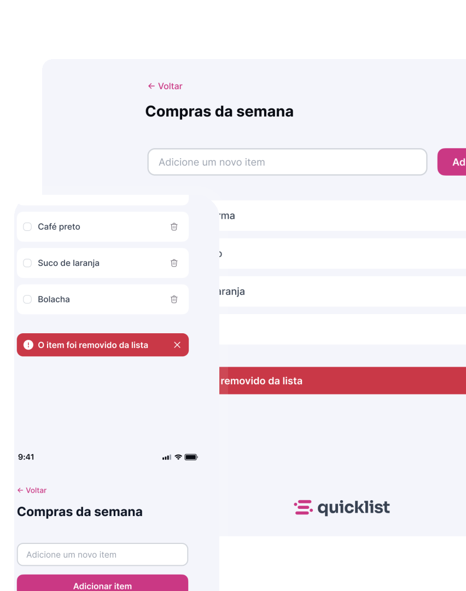

<h1 align="center">Shopping List</h1>

Manipulação da Dom com Java Script
 

  <a href="#-tecnologias">Tecnologias</a>&nbsp;&nbsp;&nbsp;|&nbsp;&nbsp;&nbsp;
  <a href="#-projeto">Projeto</a>&nbsp;&nbsp;&nbsp;|&nbsp;&nbsp;&nbsp;
  <a href="#-layout">Layout</a>&nbsp;&nbsp;&nbsp;|&nbsp;&nbsp;&nbsp;
  <a href="#memo-licença">Licença</a>

  

 

  

## 🚀 Tecnologias

Esse projeto foi desenvolvido com as seguintes tecnologias:

- Java Script
- Css
- Git e Github
- Figma

## 💻 Projeto

Desenvolvi o projeto com a finalidade de aprofundar os conhecimentos basicos em Java Script com manipulação da Dom-[Visite o projeto online]()

## 💻 Usage

## 🔖 Layout

Você pode visualizar o layout do projeto através [DESSE LINK](. É necessário ter conta no [Figma](https://figma.com) para acessá-lo.

## :memo: Licença

Esse projeto está sob a licença MIT.

---
